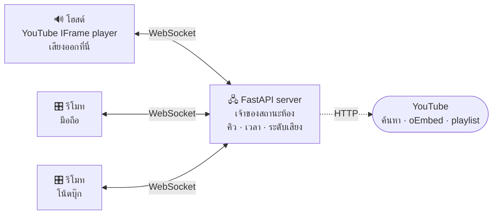

<div align="center">

# 🎵 SynHub Music

**เปิดเพลง YouTube พร้อมกันหลายเครื่อง — เสียงออกที่เครื่องเดียว ทุกคนเป็นรีโมท**


</div>

---

เครื่องที่ต่อลำโพง/ทีวีเป็น **โฮสต์** — เสียงออกที่นั่นเครื่องเดียว
ทุกคนที่เหลือเปิดเว็บเดียวกันจากมือถือตัวเองเพื่อ **ค้นหาเพลง เพิ่มเข้าคิว จัดลำดับ ข้ามเพลง และปรับเสียงลำโพง**
เซิร์ฟเวอร์เป็นเจ้าของสถานะทั้งหมดแล้ว broadcast ผ่าน WebSocket ทันทีที่มีคนกดอะไร ทุกจอจึงเห็นตรงกันเสมอ

## ⚡ เริ่มใช้ใน 3 ขั้น

```bash
pip install -r requirements.txt
python run.py
```

| ขั้น | ทำอะไร |
|:--:|---|
| 1 | **เครื่องที่ต่อลำโพง** เปิด `http://localhost:8000` → กด **สร้างห้องใหม่** |
| 2 | **เครื่องอื่น** เปิด `http://<ไอพีที่ run.py พิมพ์ให้>:8000` → กดการ์ดห้องที่เห็นบนหน้าจอ |
| 3 | พิมพ์ชื่อเพลงในช่องค้นหา → กด **+ เพิ่ม** → เพลงขึ้นคิวให้ทุกคนเห็นพร้อมกัน |

> [!TIP]
> ครั้งแรกที่เครื่องอื่นเข้ามา Windows Firewall จะถามสิทธิ์ — ต้องกดอนุญาต **Private networks**
> ไม่งั้นเพื่อนจะเข้าไม่ได้

## ✨ ความสามารถ

| | |
|---|---|
| 🔊 **เสียงออกที่เดียว** | เครื่องรีโมทไม่โหลด player เลย จึงไม่มีเสียงก้องซ้อนและไม่กินเน็ต |
| 🔍 **ค้นหาด้วยชื่อเพลง** | พิมพ์ชื่อไทย/อังกฤษ ได้ผลพร้อมภาพปกและความยาว ไม่ต้องไปหาลิงก์เอง |
| 📋 **รองรับ playlist** | วางลิงก์ playlist เพิ่มทั้งชุด สูงสุด 100 เพลง |
| ↕️ **ลากจัดลำดับคิว** | ลากที่ ≡ ไปตำแหน่งไหนก็ได้ ทั้งเมาส์บนคอมและนิ้วบนมือถือ |
| 🎚️ **ทุกคนปรับเสียงได้** | ระดับเสียงเป็นสถานะของห้อง ปรับจากมือถือแล้วดังขึ้นที่ลำโพงจริง |
| 🔁 **เพลงเสียก็ไปต่อ** | คลิปที่ฝังไม่ได้ถูกคัดออก แล้วระบบหาเวอร์ชันที่เล่นได้มาเสนอเอง |
| ⏱️ **ซิงก์ไม่เพี้ยนสะสม** | เซิร์ฟเวอร์ถือเวลาจริง ไคลเอนต์แก้ drift เองทุก 2 วินาที |
| 🎛️ **ย้ายลำโพงได้** | กดปุ่มเดียวสลับว่าเครื่องไหนเป็นตัวปล่อยเสียง |

## 🏗️ สถาปัตยกรรม



```
app/
├── server.py    FastAPI, WebSocket, สิทธิ์ควบคุม, broadcast สถานะ
├── room.py      สถานะห้อง — คิวเพลง, ตำแหน่งเพลง, ระดับเสียง, โฮสต์
└── youtube.py   แยกลิงก์, ตรวจว่าฝังได้ไหม, ค้นหาด้วยชื่อ, อ่าน playlist
static/
├── index.html   โครงหน้าเว็บ
├── app.js       ตัวซิงก์เวลา + YouTube player (สร้างเฉพาะเครื่องโฮสต์)
└── style.css    ธีมมืด
run.py           ตัวช่วยรัน พิมพ์ไอพีในวง LAN ให้ตอนเริ่ม
```

<details>
<summary><b>ระบบซิงก์ทำงานอย่างไร</b></summary>

1. `Room` เก็บตำแหน่งเพลงเป็นคู่ `(position, monotonic_mark)` — เวลาจริง ณ ตอนนี้คำนวณสด ๆ
   ไม่ใช่ตัวนับที่ต้องคอย tick จึงไม่มีทางเพี้ยนสะสม
2. ทุก broadcast แนบ `ts` (เวลาเซิร์ฟเวอร์) มาด้วย ไคลเอนต์วัด clock offset จาก ping/pong
   ทุก 15 วินาที แล้วคำนวณตำแหน่งเป้าหมาย = `position + (serverNow - ts)`
3. ทุก 2 วินาทีไคลเอนต์เทียบเวลาเพลงจริงกับเป้าหมาย ถ้าเพี้ยนเกิน **1.2 วินาที** ค่อย `seekTo`
   (เผื่อไว้กว้างพอไม่ให้กระตุกจากอาการเน็ตสะดุดชั่วครู่)

</details>

## 👥 บทบาทในห้อง

| | 🔊 โฮสต์ (ลำโพง) | 🎛️ รีโมท |
|---|---|---|
| โหลด YouTube player | ใช่ — เสียงออกที่นี่ | **ไม่โหลดเลย** ไม่มีเสียงซ้อน ไม่กินเน็ต |
| เพิ่ม / ลบ / ข้าม / จัดลำดับ | ได้ | ได้ (ถ้าโฮสต์ไม่ล็อกสิทธิ์) |
| ปรับเสียงลำโพง | ได้ | ได้ — ปรับจากเครื่องไหนก็มีผลที่ลำโพง |
| ล็อกสิทธิ์ให้เฉพาะตัวเอง | ได้ | ไม่ได้ |

- คนแรกที่เข้าห้องเป็นโฮสต์ ถ้าโฮสต์หลุด เครื่องถัดไปรับช่วงอัตโนมัติ
- กด **ย้ายลำโพงมาเครื่องนี้** เพื่อสลับตัวปล่อยเสียง
- รีโมทไม่มี player จึงไม่รู้ความยาวเพลง — โฮสต์เป็นคนรายงานความยาวขึ้นเซิร์ฟเวอร์ให้
- การจบเพลงและการรายงานว่าเล่นไม่ได้ รับจากโฮสต์เครื่องเดียว และต้องแนบ `videoId` ให้ตรงกับ
  เพลงหัวแถว กันการข้ามซ้อนตอนเปลี่ยนเพลงพอดี

## 🎼 คิวเพลง

คิว **ไหลจากหัวแถว** — `queue[0]` คือเพลงที่กำลังเล่น เล่นจบหรือกดข้ามแล้วหลุดออกจากคิวไปเลย
ไม่มีตัวชี้ index ให้สับสน (ปุ่ม ⟲ คือ *เริ่มเพลงนี้ใหม่* ไม่ใช่ย้อนเพลง เพราะเพลงเก่าไม่อยู่ในคิวแล้ว)

| ปุ่ม | ทำอะไร |
|:--:|---|
| ≡ | ลากย้ายไปตำแหน่งไหนก็ได้ มีเส้นบอกจุดวาง และเลื่อนลิสต์ให้เองเมื่อลากใกล้ขอบ |
| ▶ | เล่นเพลงนี้เลย — เพลงที่เล่นอยู่ถูกดันไปเป็นเพลงถัดไป ไม่หายจากคิว |
| ✕ | เอาออกจากคิว |

ปุ่ม **สุ่ม** สลับเฉพาะเพลงที่ยังไม่ได้เล่น ไม่แตะเพลงที่กำลังเล่นอยู่

<details>
<summary><b>รายละเอียดการลากจัดลำดับ</b></summary>

ใช้ pointer event จึงลากได้ทั้งเมาส์และนิ้ว (`touch-action: none` ที่ตัวจับ กันหน้าเว็บเลื่อนตามนิ้ว)

- ตำแหน่งที่ปล่อยคือ "แทรกก่อนแถวนั้น" ถ้าย้ายลงข้างล่างต้องหักหนึ่ง เพราะตัวเองถูกดึงออกจากคิวก่อน
- **ห้ามวาดคิวใหม่ระหว่างลาก** ไม่งั้น DOM ที่กำลังลากหายกลางทางเมื่อเซิร์ฟเวอร์ส่งสถานะมาพอดี
  (แยกออกเป็น `renderQueue()` เพื่อข้ามเฉพาะส่วนนั้น ส่วนอื่นยังอัปเดตปกติ)
- วางที่ตำแหน่ง 0 ถูกกันไว้เป็น 1 ไม่ให้เผลอแทรกทับเพลงที่กำลังเล่น (ใช้ปุ่ม ▶ แทน)
- ดัก `pointerup` ระดับเอกสารด้วย เผื่อปล่อยนิ้วนอกลิสต์ ไม่ให้สถานะลากค้างจนคิวไม่อัปเดตอีก
- ฝั่งเซิร์ฟเวอร์ `Room.move()` รับตำแหน่งใดก็ได้อยู่แล้ว

</details>

## ➕ เพิ่มเพลง

**ช่องเดียวทำสองหน้าที่ — พิมพ์ชื่อเพลงคือค้นหา วางลิงก์คือเพิ่มทันที**

| สิ่งที่วาง / พิมพ์ | ระบบทำอะไร |
|---|---|
| ชื่อเพลง | ค้นหาให้ พร้อมภาพปก ความยาว ชื่อช่อง — กด **+ เพิ่ม** ทีละเพลงได้หลายเพลงติดกัน |
| ลิงก์คลิป | ตรวจว่าฝังเล่นได้ก่อน แล้วเพิ่มเข้าคิวทันที |
| ลิงก์ `playlist?list=…` | เพิ่มทั้งชุด สูงสุด 100 เพลงแรก คัดเพลงที่ฝังไม่ได้ออก แล้วสรุปว่าเพิ่ม/ข้ามกี่เพลง |
| ลิงก์ `watch?v=…&list=…` | ถือว่าต้องการคลิปนั้นคลิปเดียว ไม่ยัดทั้ง playlist มาให้ |

**เจอคลิปที่ฝังไม่ได้ ระบบหาเวอร์ชันที่เล่นได้มาเสนอเอง** — ตัดชื่อเพลงให้สั้นลง (ตัดวงเล็บ,
`[...]`, `feat.` ออก) ค้นหาใหม่ คัดคลิปเดิมทิ้ง ตรวจ 8 ตัวแรก แล้วส่งที่ผ่านสูงสุด 5 รายการ
ให้ทุกเครื่องเห็นตรงกัน ทำงานทั้งตอนตรวจก่อนเพิ่มและตอนเจอ error ระหว่างเล่นจริง

<details>
<summary><b>ทำงานได้โดยไม่ต้องใช้ API key อย่างไร</b></summary>

- **ตรวจการฝัง** ผ่าน oEmbed ของ YouTube (คลิปที่ปิดการฝังตอบ 401/403) ถ้าตรวจไม่สำเร็จ
  เพราะเน็ตขัดข้อง ระบบปล่อยให้เพิ่มไปก่อนแล้วอาศัยการดักตอนเล่นจริงเป็นด่านสุดท้าย
- **ค้นหา** อ่าน `videoRenderer` จาก JSON ที่ฝังมาในหน้าผลค้นหา ใช้ตัวตัด JSON แบบนับวงเล็บสมดุล
  แคชไว้ 5 นาที (คำค้นซ้ำตอบใน ~15 ms เทียบกับ ~1.2 s ครั้งแรก) และตัดถ่ายทอดสด/Shorts ออก
  โดยดูจากการไม่มีความยาวคลิป
- **playlist** อ่าน `lockupViewModel → contentId` จากหน้า playlist
- **ชื่อคลิปที่ปิดการฝัง** อ่านจาก `<meta name="title">` ในหน้า watch เพราะ oEmbed ไม่ยอมบอก

ข้อแลกเปลี่ยน: วิธีนี้พึ่งโครงสร้างหน้าเว็บของ YouTube ซึ่งเปลี่ยนได้ตลอด (เคยเปลี่ยนจาก
`playlistVideoRenderer` มาเป็น `lockupViewModel` มาแล้ว) ถ้าอยากทนทานกว่านี้ต้องใช้ YouTube Data API

</details>

## 🎚️ ระดับเสียง

ระดับเสียงเป็นสถานะของห้อง ปรับจากเครื่องไหนก็มีผลที่ลำโพงของโฮสต์
ป้ายเล็ก ๆ ข้างแถบเสียงบนเครื่องโฮสต์โชว์ค่าที่ player รายงานตลอด — **สีเทาคือตรงกัน สีเหลืองคือมีปัญหา**

<details>
<summary><b>ทำไมต้องมีกลไกถึงสี่ชั้น</b></summary>

YouTube IFrame player ดื้อกว่าที่คิดหลายเรื่อง แต่ละข้อคือบั๊กจริงที่เจอมาแล้ว:

1. **ปลด mute ก่อนตั้งค่า — เฉพาะเมื่อเสียงมากกว่า 0** mute กับระดับเสียงเป็นของแยกกัน
   ถ้ายัง mute อยู่ `setVolume` จะตั้งค่าให้จริงแต่ไม่มีเสียงออก (Chrome บังคับ mute ตอน autoplay)
   แต่ **ที่ระดับเสียง 0 ตัว player รายงานว่าตัวเองอยู่ในสถานะ mute** ถ้าเผลอสั่ง `unMute()` ตรงนั้น
   YouTube จะคืนระดับเสียงเดิมที่จำไว้กลับมา เสียงจะโผล่เป็นจังหวะทุกครั้งที่ `sync()` ทำงาน
2. **สะกิดให้ player เอาค่าไปใช้จริง** บางเครื่อง `setVolume` เก็บค่าให้แต่ไม่ส่งผลกับเสียงจริง
   จนกว่าจะ *เริ่มเล่นใหม่* (อาการ: ปรับ 1–100 แล้วดังเท่ากันหมด) จึง `pauseVideo()` แล้ว
   `playVideo()` ให้อัตโนมัติ ห่างกัน 80 ms — สะกิดเฉพาะเมื่อค่าเปลี่ยน หน่วง 200 ms หลังค่านิ่ง
   ไม่สะกิดตอนห้องสั่งหยุดและไม่สะกิดที่ระดับ 0 ตำแหน่งเพลงไม่หลุดเพราะช่องว่าง 80 ms
   ไม่ถึงเกณฑ์ 1.2 วินาทีที่จะสั่ง seek แก้ drift
3. **อ่านค่ากลับมาตรวจ** หลังสั่ง 300 ms อ่าน `getVolume()` มาเทียบ ถ้าไม่ตรงก็สั่งซ้ำและฟ้องบนป้าย
4. **`volumeSeq`** เครื่องที่เพิ่งลากแถบเสียงยึดค่าของตัวเองไว้จนเซิร์ฟเวอร์บันทึกจริง (ดูจาก
   `volumeSeq` เดินหน้า) ไม่งั้น `sync()` รอบถัดไปจะเอาค่าเก่ามาทับ ทำให้เหมือนปรับแล้วไม่มีอะไรเกิดขึ้น
   — และเพราะใช้ตัวนับ ไม่ใช่การเทียบค่า เครื่องอื่นสั่งค่าใหม่มาระหว่างนั้นจึงยังยอมตามทันที

</details>

## 🔧 เจอปัญหา

| อาการ | สาเหตุ / ทางแก้ |
|---|---|
| เครื่องอื่นเปิดแล้วหน้าไม่เปลี่ยน หรือไม่มีฟีเจอร์ใหม่ | แคชเบราว์เซอร์ค้าง — กด `Ctrl+Shift+R` ที่เครื่องนั้น |
| `[WinError 10048] only one usage of each socket address` | พอร์ต 8000 ถูกจองอยู่ — `netstat -ano \| findstr :8000` แล้ว `taskkill /PID <pid> /F` |
| `ConnectionResetError [WinError 10054]` ใน log | เสียงรบกวนของ asyncio บน Windows ตอนไคลเอนต์หลุด **ไม่กระทบการทำงาน** (มีตัวกรองแล้ว) |
| ภาษาไทยใน Terminal เพี้ยน | codepage ของ console — พิมพ์ `chcp 65001` ก่อนรัน (ตัวเว็บไม่มีปัญหานี้) |
| ปรับเสียงแล้วไม่เปลี่ยน | ดูป้ายข้างแถบเสียง ถ้าขึ้นสีเหลืองแปลว่า player ไม่รับค่า ถ้าไม่ขึ้นเลยให้เช็คว่าเสียงมาจากแท็บ YouTube อื่นหรือเปล่า |
| เพลงขึ้นว่า *ดูวิดีโอไม่ได้* | เจ้าของคลิปปิดการฝัง — ระบบข้ามให้และเสนอเวอร์ชันอื่นแล้ว เลือกจากรายการที่เสนอมา |

## ⚠️ ข้อจำกัดที่ควรรู้

- **คลิปที่เจ้าของปิดการฝังเล่นไม่ได้** — MV จากค่ายเพลงส่วนใหญ่ปิดไว้ ไม่ใช่แค่เว็บนี้แต่ทุกเว็บ
  ที่ฝัง YouTube เจอเหมือนกัน ระบบคัดออกตั้งแต่ตอนเพิ่ม ถ้ายังหลุดมาได้จะจับ error 101/150
  ตอนเล่นแล้วเอาออกจากคิวพร้อมเสนอเวอร์ชันที่เล่นได้แทน
- **สถานะห้องเก็บในหน่วยความจำ** รีสตาร์ทเซิร์ฟเวอร์แล้วคิวหาย
- **ยังไม่มีรหัสผ่านห้อง** ใครเข้าถึงเซิร์ฟเวอร์ได้ก็เข้าได้ทุกห้อง — ออกแบบมาสำหรับใช้ในวง LAN
  ถ้าจะ deploy ขึ้นอินเทอร์เน็ตต้องเพิ่มการยืนยันตัวตนก่อน
- เปลี่ยนตัวโฮสต์ระหว่างเพลง เครื่องใหม่ต้องโหลดคลิปตั้งต้น เสียงจะขาดไปหนึ่งจังหวะ
- ถ้าเบราว์เซอร์ยังบล็อกเสียงอัตโนมัติ จะมีปุ่ม *เบราว์เซอร์บล็อกเสียง — แตะเพื่อเล่น* ให้กดเอง

## 🗺️ ต่อยอดได้อีก

- [ ] **รองรับไฟล์เพลงในเครื่อง (MP3)** — คุมได้ 100% ซิงก์แม่นกว่า ปรับเสียงได้ทันทีโดยไม่ต้องสะกิด
- [ ] เก็บคิวลง SQLite ให้ห้องเดิมกลับมาเล่นต่อได้หลังรีสตาร์ท
- [ ] โหวตข้ามเพลง (ต้องเกินครึ่งห้อง) แทนการให้ทุกคนกดข้ามได้เอง
- [ ] โหมดจอใหญ่ + audio visualizer ด้วย Three.js สำหรับเครื่องที่ต่อทีวี
- [ ] ใช้ YouTube Data API key เพื่อตรวจ `status.embeddable` แบบแม่นยำ และค้นหาที่ทนต่อการเปลี่ยนหน้าเว็บ
- [ ] อ่าน playlist เกิน 100 เพลง (ตาม continuation token ต่อ)
- [ ] รหัสผ่านห้อง + deploy ขึ้น Fly.io ให้เพื่อนนอกวง LAN เข้าร่วมได้
