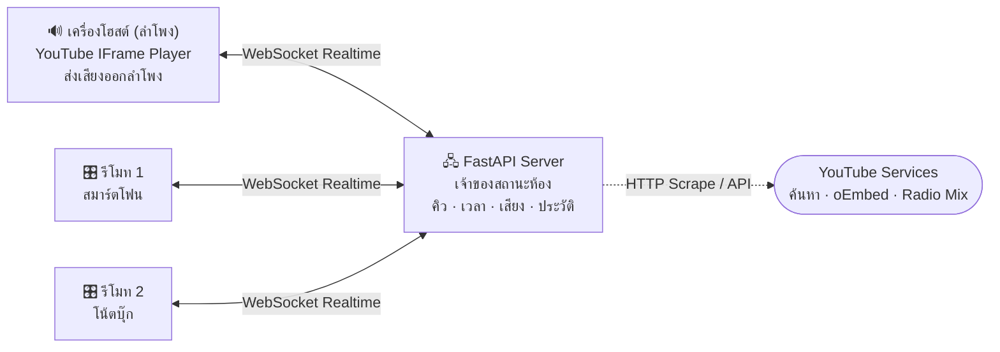

<div align="center">

# 🎵 SynTech Music

**เปิดเพลง YouTube พร้อมกันหลายเครื่อง — เสียงออกที่โฮสต์ ทุกคนเป็นรีโมทคุมเพลงยุคใหม่**


</div>

---

เครื่องที่ต่อลำโพง/ทีวีเป็น **โฮสต์** — เสียงออกที่นั่นเครื่องเดียว  
ทุกคนที่เหลือเปิดเว็บเดียวกันจากมือถือหรือคอมพิวเตอร์ตัวเองเพื่อ **ค้นหาเพลง เพิ่มเข้าคิว จัดลำดับ ข้ามเพลง วนซ้ำ และปรับเสียงลำโพง**  
เซิร์ฟเวอร์เป็นเจ้าของสถานะทั้งหมดแล้ว Broadcast ผ่าน WebSocket ทันทีที่มีคนสั่งอะไร ทุกจอจึงซิงก์ตรงกันเสมอ ⚡

---

## ⚡ เริ่มใช้งานใน 3 ขั้นตอน

```bash
pip install -r requirements.txt
python run.py
```

| ขั้น | ทำอย่างไร |
|:--:|---|
| 1 | **เครื่องที่ต่อลำโพง (โฮสต์)** เปิด `http://localhost:8000` → กด **+ สร้างห้องใหม่** |
| 2 | **เครื่องอื่น (รีโมท)** เปิด `http://<ไอพีในวง LAN>:8000` → กดการ์ดห้องที่เห็นบนหน้าจอ |
| 3 | พิมพ์ชื่อเพลงในช่องค้นหา หรือวางลิงก์ YouTube → กด **+ เพิ่ม** → เพลงขึ้นคิวเล่นทันที |

> [!TIP]
> ครั้งแรกที่เครื่องอื่นเข้ามา Windows Firewall อาจถามสิทธิ์ — ต้องกดอนุญาต **Private networks** ไม่งั้นเพื่อนในวง Wi-Fi เดียวกันจะเข้าไม่ได้

---

## ✨ ความสามารถหลัก (Features)

| ฟังก์ชัน | รายละเอียดการทำงาน |
|---|---|
| 🔊 **เสียงออกที่โฮสต์เครื่องเดียว** | เครื่องรีโมทไม่โหลดตัวเล่นวิดีโอ จึงไม่มีเสียงก้องซ้อน ประหยัดเน็ตและแบตเตอรี่ |
| ⚡ **ค้นหาเพลงสดขณะพิมพ์** | พิมพ์ชื่อเพลงไทย/อังกฤษ ระบบค้นสดให้อัตโนมัติ (550ms Debounce + Cancel Request ป้องกัน YouTube บล็อก) |
| 📋 **ดึงเพลงทั้ง Playlist & Mix** | รองรับลิงก์ Playlist ปกติ และ YouTube Radio Mix (`list=RD...`) ดึงทั้งมิกซ์สูงสุด 100 เพลง |
| 🔁 **โหมดวนซ้ำ (Repeat Modes)** | สลับโหมดได้ 3 ระดับ: `➡️ ไม่ซ้ำ`, `🔁 วนซ้ำคิว`, `🔂 วนซ้ำเพลงนี้` |
| 🔇 **ปุ่มเปิด/ปิดเสียงด่วน (Quick Mute)** | คลิกไอคอน 🔊 / 🔇 ปิดเสียงลำโพงด่วน และคืนค่าระดับเสียงเดิมเมื่อเปิด |
| ⌨️ **คีย์บอร์ดลัด (Shortcuts)** | ควบคุมเพลงด้วยคีย์บอร์ด: `Space` (เล่น/หยุด), `N` (ข้าม), `M` (Mute), `R` (Repeat), `S` (สุ่ม), `↑/↓` (ปรับเสียง) |
| 📜 **ประวัติเพลงที่เพิ่งเล่น** | บันทึก 20 เพลงล่าสุดที่เล่นจบไปแล้ว พร้อมปุ่ม `+ เล่นอีกครั้ง` |
| ↕️ **ลากจัดลำดับคิว (Drag & Drop)** | ลากที่ ≡ เพื่อย้ายคิวเพลง รองรับทั้งเมาส์บนคอมและนิ้วสัมผัสบนมือถือ |
| 🎚️ **ทุกคนปรับเสียงลำโพงได้** | ปรับสไลเดอร์เสียงลื่นไหล ไม่กระตุก และเลื่อนตำแหน่งเพลงได้แม่นยำ |
| 🎨 **สลับธีมสีบรรยากาศ (Theme Switcher)** | สลับโทนสีได้ 3 สไตล์: `มรกต (Emerald)`, `ทองนีออน (Amber)`, `นีออนม่วง (Neon Synthwave)` |
| 📱 **รองรับ PWA** | กด "Add to Home Screen" บน iOS / Android เพื่อใช้งานเป็นแอปพลิเคชันไร้ขอบ |
| 📐 **รองรับทุกขนาดหน้าจอ** | Responsive 100% ตั้งแต่จอ 4K, โน้ตบุ๊ก, แท็บเล็ต, มือถือแนวตั้ง/นอน และจอพับ |

---

## ⌨️ คีย์บอร์ดลัด (Keyboard Shortcuts)

| ปุ่มบนคีย์บอร์ด | ฟังก์ชันการทำงาน |
|:--:|---|
| **`Spacebar`** หรือ **`K`** | เล่น / หยุดเพลง (Play / Pause) |
| **`N`** | ข้ามไปเพลงถัดไป (Next Track) |
| **`M`** | ปิด / เปิดเสียงด่วน (Mute / Unmute Toggle) |
| **`R`** | สลับโหมดวนซ้ำ (`➡️ ไม่ซ้ำ` → `🔁 วนซ้ำคิว` → `🔂 วนซ้ำเพลงนี้`) |
| **`S`** | สุ่มคิวเพลง (Shuffle Queue) |
| **`ลูกศรขึ้น ↑` / `ลูกศรลง ↓`** | เพิ่ม / ลด เสียงลำโพงทีละ 5% |

*(ระบบจะข้ามคีย์บอร์ดลัดอัตโนมัติขณะกำลังพิมพ์ชื่อเพลงในช่องค้นหา)*

---

## 🏗️ สถาปัตยกรรมระบบ (Architecture)



### โครงสร้างไฟล์ในโปรเจกต์
```text
SynHub/Music/
├── app/
│   ├── server.py    FastAPI, WebSocket Handlers, Broadcast, สิทธิ์ควบคุม
│   ├── room.py      สถานะห้อง — คิวเพลง, ประวัติเพลง, โหมดวนซ้ำ, เวลา, เสียง
│   └── youtube.py   แยกลิงก์, สแกน Playlist/Radio Mix, ตรวจการฝัง, ค้นหาสด
├── static/
│   ├── index.html   โครงหน้าเว็บ UI Responsive & Meta PWA
│   ├── app.js       ตัวซิงก์เวลา, YouTube IFrame Controller, Hotkeys, ธีม
│   ├── style.css    ระบบดีไซน์ Cyber Emerald, ธีมสลับสี, CSS Grid Layout
│   ├── logo.svg     โลโก้ SynTech Music หลัก
│   ├── logo-mark.svg ไอคอนสัญลักษณ์ SynTech
│   └── manifest.json ไฟล์ Manifest สำหรับ PWA (Add to Home Screen)
└── run.py           สคริปต์ช่วยรัน พร้อมตรวจหาไอพีในวง LAN ให้อัตโนมัติ
```

---

## 👥 บทบาทเครื่องในห้อง

| ความสามารถ | 🔊 เครื่องโฮสต์ (ลำโพง) | 🎛️ เครื่องรีโมท |
|---|:--:|:--:|
| โหลด YouTube Player จริง | **ใช่** (เสียงออกที่นี่) | **ไม่โหลด** (ประหยัดเน็ต) |
| ค้นหา / เพิ่ม / ลบ / จัดคิว | ได้ | ได้ (หากเปิดสิทธิ์) |
| ปรับระดับเสียงลำโพง | ได้ | ได้ (ส่งผลที่ลำโพงโฮสต์) |
| สลับโหมดวนซ้ำ (Repeat) | ได้ | ได้ |
| ตั้งค่าล็อกสิทธิ์เฉพาะโฮสต์ | ได้ | ไม่ได้ |

- **ย้ายลำโพงได้ทุกเมื่อ**: กดปุ่ม **"ย้ายลำโพงมาเครื่องนี้"** เพื่อสลับเครื่องปล่อยเสียงได้ทันที
- **สลับเป็นรีโมทอัตโนมัติ**: เครื่องเดิมจะกลายเป็นรีโมททันทีโดยไม่ต้องรีโหลดหน้าเว็บ

---

## ➕ การดึงเพลงและ Playlist

| สิ่งที่วาง / พิมพ์ | การทำงานของระบบ |
|---|---|
| **ชื่อเพลง** | ค้นหาแบบสด (Debounce 550ms + AbortController) แสดงปก ความยาว ช่อง |
| **ลิงก์คลิป** | ตรวจการฝังเล่นได้จริง แล้วเพิ่มเข้าคิวทันที |
| **ลิงก์ Playlist** (`list=PL...`) | ดึงรายการเพลงทั้งหมดสูงสุด 100 เพลงแรกเข้าคิว |
| **ลิงก์ Radio Mix** (`list=RD...`) | ดึงรายการเพลงจากสถานีวิทยุมิกซ์ทั้งหมดเข้าคิวอัตโนมัติ |

---

## 🔧 การแก้ไขปัญหาที่พบบ่อย (Troubleshooting)

| อาการ | สาเหตุ / วิธีแก้ |
|---|---|
| เครื่องอื่นเปิดเว็บไม่ได้ | เช็คว่าเชื่อมต่อ Wi-Fi วงเดียวกันหรือไม่ หรือปิด Windows Firewall พอร์ต 8000 |
| หน้าเว็บไม่แสดงฟังก์ชันใหม่ | กด `Ctrl + Shift + R` เพื่อล้างแคชเบราว์เซอร์ |
| `[WinError 10048] address in use` | พอร์ต 8000 ถูกโปรแกรมอื่นใช้อยู่ ให้ปิดโปรแกรมเดิมแล้วรัน `python run.py` ใหม่ |
| เบราว์เซอร์บล็อกเสียง | กดปุ่ม **"เบราว์เซอร์บล็อกเสียง — แตะเพื่อเล่น"** ที่ปรากฏบนจอเพื่อปลดล็อก Autoplay |

---

<div align="center">
  <b>Developed with ❤️ for SynTech Music Hub</b>
</div>
