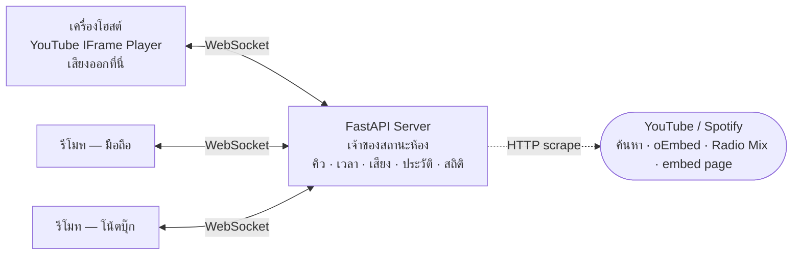

# SynTech Music

เปิดเพลง YouTube พร้อมกันหลายเครื่องในวง LAN เดียวกัน เสียงออกที่เครื่องเดียว ที่เหลือเป็นรีโมท

เครื่องที่ต่อลำโพงหรือทีวีทำหน้าที่เป็น **โฮสต์** — โหลด YouTube player จริงและเป็นเครื่องเดียวที่มีเสียง
เครื่องอื่นเปิดเว็บเดียวกันจากมือถือหรือโน้ตบุ๊กเพื่อค้นหาเพลง เพิ่มคิว จัดลำดับ ข้าม วนซ้ำ และปรับเสียงลำโพง

สถานะห้องทั้งหมดอยู่ที่เซิร์ฟเวอร์ ไม่ได้อยู่ที่เบราว์เซอร์ ทุกคำสั่ง broadcast ผ่าน WebSocket ทันที
ทุกจอจึงเห็นคิวและตำแหน่งเพลงตรงกัน ไม่ต้องรีเฟรช

ไม่ต้องใช้ YouTube API key

---

## เริ่มใช้งาน

```bash
pip install -r requirements.txt
python run.py
```

`run.py` จะพิมพ์ URL ทั้งของเครื่องตัวเองและไอพีในวง LAN ให้อัตโนมัติ

| ขั้น | ทำอะไร |
|:--:|---|
| 1 | เครื่องที่ต่อลำโพง เปิด `http://localhost:8000` แล้วกด **+ สร้างห้องใหม่** |
| 2 | เครื่องอื่น เปิด `http://<ไอพี LAN>:8000` แล้วกดการ์ดห้องที่ขึ้นบนหน้าจอ |
| 3 | พิมพ์ชื่อเพลงในช่องค้นหา หรือวางลิงก์ YouTube / Spotify แล้วกด **ค้นหา** |

ครั้งแรกที่มีเครื่องอื่นเข้ามา Windows Firewall จะถามสิทธิ์ ต้องอนุญาต **Private networks**
ไม่งั้นเครื่องในวง Wi-Fi เดียวกันจะเข้าไม่ได้

ต้องใช้ Python 3.12 ขึ้นไป dependency มีแค่ FastAPI กับ uvicorn

---

## ความสามารถ

| ฟังก์ชัน | ทำงานยังไง |
|---|---|
| เสียงออกที่โฮสต์เครื่องเดียว | เครื่องรีโมทไม่โหลด YouTube player เลย จึงไม่มีเสียงซ้อนและไม่กินเน็ต/แบต |
| ย้ายลำโพงได้ทุกเมื่อ | กด "ย้ายลำโพงมาเครื่องนี้" เครื่องเดิมกลายเป็นรีโมททันที ไม่ต้องรีโหลดหน้า |
| ค้นหาสดขณะพิมพ์ | หน่วง 550ms แล้วยิงค้นหา ใช้ `AbortController` ยกเลิกคำค้นเก่า ส่งกลับ 12 ผลลัพธ์ |
| ดึงทั้ง Playlist และ Radio Mix | ลิงก์ `list=PL...` และ `list=RD...` ดึงได้สูงสุด 100 เพลงต่อครั้ง |
| นำเข้าจาก Spotify | วางลิงก์ track / playlist / album อ่านชื่อเพลงจากหน้า embed แล้วไปหาคลิปที่ตรงกันบน YouTube |
| Auto DJ | คิวหมดแล้วหาเพลงต่อเองจาก YouTube Mix ของเพลงล่าสุด กรองเพลงซ้ำและคลิปที่ไม่ใช่เพลงออก **ปิดไว้เป็นค่าเริ่มต้น** ต้องกดเปิดเอง |
| โหมดวนซ้ำ | 3 ระดับ ไม่ซ้ำ → วนซ้ำคิว → วนซ้ำเพลงนี้ |
| ลากจัดลำดับคิว | ลากที่ `≡` ใช้ได้ทั้งเมาส์และนิ้ว |
| ประวัติเพลงที่เล่นจบ | เก็บ 15 เพลงล่าสุด กดเพิ่มกลับเข้าคิวได้ |
| กระดานสถิติ DJ | นับจำนวนเพลงและเวลารวมที่แต่ละคนเปิด จัดอันดับในห้อง |
| ทุกคนปรับเสียงลำโพงได้ | สไลเดอร์ส่งผลที่ลำโพงโฮสต์ มี sequence number กันค่าเก่าทับค่าใหม่ |
| ล็อกสิทธิ์เฉพาะโฮสต์ | ปิดสวิตช์ "ให้ทุกเครื่องคุมเพลง" แล้วเหลือแค่โฮสต์ที่สั่งได้ |
| PWA | Add to Home Screen บน iOS/Android ใช้เป็นแอปไร้ขอบได้ |

---

## คีย์บอร์ดลัด

ใช้ได้เมื่อเคอร์เซอร์ไม่ได้อยู่ในช่องพิมพ์ และไม่ได้กด Ctrl/Alt/Cmd ค้าง

| ปุ่ม | ทำอะไร |
|:--:|---|
| `Space` หรือ `K` | เล่น / หยุด |
| `N` | ข้ามเพลง |
| `M` | ปิด / เปิดเสียง |
| `R` | สลับโหมดวนซ้ำ |
| `S` | สุ่มคิว |
| `↑` / `↓` | เพิ่ม / ลดเสียงทีละ 5 |

---

## สถาปัตยกรรม



เซิร์ฟเวอร์เก็บ **ตำแหน่งเพลงเป็น timestamp** ไม่ใช่ตัวนับที่เดินเอง ฝั่งไคลเอนต์คำนวณตำแหน่งจริงจาก
เวลาเซิร์ฟเวอร์ที่วัด offset ไว้ แล้ว `sync()` เทียบทุก 2 วินาที ถ้าเพี้ยนเกินเกณฑ์ค่อย seek
วิธีนี้ทำให้เครื่องที่เข้าห้องช้าเริ่มเล่นตรงตำแหน่งเดียวกับคนอื่นได้เลย

### ไฟล์ในโปรเจกต์

```text
SynHub/Music/
├── app/
│   ├── server.py     FastAPI, WebSocket handler, broadcast, สิทธิ์ควบคุม, Auto DJ trigger
│   ├── room.py       สถานะห้อง — คิว, ประวัติ, โหมดวนซ้ำ, ตำแหน่งเพลง, เสียง, สถิติ DJ
│   └── youtube.py    แยกลิงก์, สแกน playlist/mix, นำเข้า Spotify, ตรวจการฝัง, ค้นหา, หาเพลง Auto DJ
├── static/
│   ├── index.html    โครงหน้าเว็บและ meta สำหรับ PWA
│   ├── app.js        ซิงก์เวลา, ควบคุม YouTube IFrame, WebSocket, คีย์ลัด, ลากจัดคิว
│   ├── style.css     ระบบดีไซน์ธีมมืดเขียว-ทอง
│   ├── logo.svg      โลโก้เต็ม
│   ├── logo-mark.svg ไอคอน
│   └── manifest.json manifest ของ PWA
└── run.py            ตัวช่วยรัน หาไอพี LAN ให้อัตโนมัติ
```

### HTTP endpoints

| Endpoint | ใช้ทำอะไร |
|---|---|
| `GET /` | หน้าเว็บ |
| `GET /api/new-room` | ขอรหัสห้องใหม่ |
| `GET /api/rooms` | รายชื่อห้องที่เปิดอยู่ ใช้วาดการ์ดหน้าแรก |
| `GET /api/search?q=` | ค้นหาเพลง |
| `WS /ws/{code}` | ช่องทางหลักทั้งหมด — เพิ่ม/ลบ/ย้ายคิว, play/pause/seek/next, เสียง, สิทธิ์ |

---

## บทบาทเครื่องในห้อง

| ทำอะไรได้ | โฮสต์ (ลำโพง) | รีโมท |
|---|:--:|:--:|
| โหลด YouTube player | ใช่ เสียงออกที่นี่ | ไม่โหลด |
| ค้นหา / เพิ่ม / ลบ / จัดคิว | ได้ | ได้ ถ้าเปิดสิทธิ์ |
| ปรับเสียงลำโพง | ได้ | ได้ ส่งผลที่ลำโพงโฮสต์ |
| เล่น / หยุด / ข้าม / วนซ้ำ | ได้ | ได้ ถ้าเปิดสิทธิ์ |
| ตั้งค่าล็อกสิทธิ์เฉพาะโฮสต์ | ได้ | ไม่ได้ |

โฮสต์คุมได้เสมอ แม้ปิดสิทธิ์คนอื่นไปแล้ว

---

## สิ่งที่วางลงช่องค้นหาได้

| วางอะไร | ระบบทำอะไรต่อ |
|---|---|
| ชื่อเพลง | ค้นหาสด แสดงปก ความยาว ชื่อช่อง ให้เลือกก่อนเพิ่ม |
| ลิงก์คลิป | ตรวจว่าฝังเล่นได้จริงก่อน ถ้าเล่นไม่ได้จะเสนอคลิปอื่นที่ใกล้เคียง |
| `list=PL...` | ดึงเพลงในเพลย์ลิสต์เข้าคิว สูงสุด 100 เพลง |
| `list=RD...` | ดึงเพลงจาก Radio Mix เข้าคิว |
| ลิงก์ Spotify | อ่านชื่อเพลงจากหน้า embed แล้วหาคลิปที่ตรงกันบน YouTube ใช้ได้เฉพาะเพลย์ลิสต์สาธารณะ |

---

## ปัญหาที่เจอบ่อย

| อาการ | สาเหตุ / วิธีแก้ |
|---|---|
| เครื่องอื่นเปิดเว็บไม่ได้ | เช็คว่าอยู่ Wi-Fi วงเดียวกัน และ Firewall อนุญาตพอร์ต 8000 แบบ Private network แล้ว |
| หน้าเว็บไม่เห็นของใหม่ | กด `Ctrl + Shift + R` ล้างแคช (ไฟล์ static มี `?v=` กันแคชอยู่แล้ว แต่บางเบราว์เซอร์ดื้อ) |
| `[WinError 10048] address in use` | พอร์ต 8000 มีโปรแกรมอื่นใช้อยู่ ปิดตัวเดิมก่อนแล้วรัน `python run.py` ใหม่ |
| ขึ้น "เบราว์เซอร์บล็อกเสียง" | เบราว์เซอร์ไม่ให้เล่นเสียงก่อนผู้ใช้แตะหน้าจอ กดปุ่มบนจอหรือแตะที่ไหนก็ได้หนึ่งครั้ง |
| นำเข้า Spotify ไม่สำเร็จ | เพลย์ลิสต์เป็นแบบส่วนตัว หน้า embed จึงอ่านไม่ได้ ต้องตั้งเป็น public ก่อน |
| Auto DJ ไม่ทำงาน | ค่าเริ่มต้นปิดอยู่ ต้องกดปุ่ม Auto DJ ให้ขึ้นสถานะ "เปิด" และต้องมีประวัติเพลงอย่างน้อย 1 เพลงเป็น seed |

---

## หมายเหตุการพัฒนา

- ข้อมูลห้องเก็บในหน่วยความจำล้วน ไม่มีฐานข้อมูล รีสตาร์ตเซิร์ฟเวอร์แล้วห้องหายหมด
- การค้นหาและดึงเพลย์ลิสต์ใช้วิธี scrape หน้าเว็บ YouTube ไม่ได้เรียก Data API
  ถ้า YouTube เปลี่ยนโครงสร้างหน้า ตัว parser ใน `youtube.py` จะต้องแก้ตาม
- ออกแบบมาสำหรับวง LAN ที่เชื่อใจกันได้ ไม่มีระบบยืนยันตัวตน ใครรู้รหัสห้องก็เข้าได้
