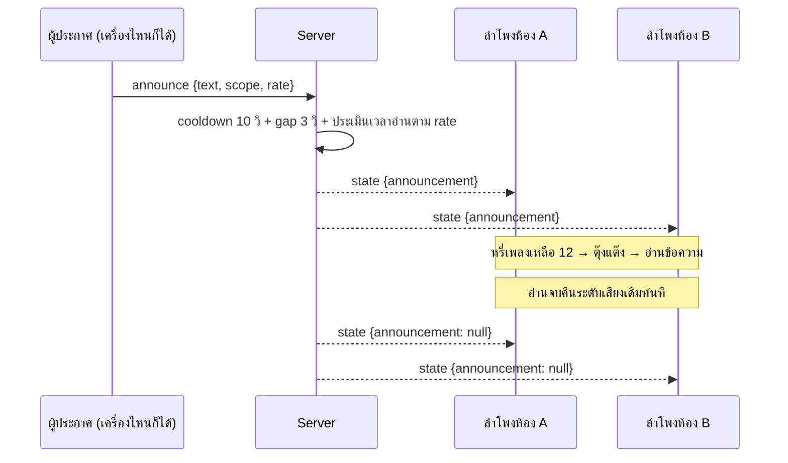

# SynTech Music

เปิดเพลง YouTube พร้อมกันหลายเครื่องในวง LAN เดียวกัน เสียงออกที่เครื่องเดียว ที่เหลือเป็นรีโมท

เครื่องที่ต่อลำโพงหรือทีวีทำหน้าที่เป็น **โฮสต์** — โหลด YouTube player จริงและเป็นเครื่องเดียวที่มีเสียง
เครื่องอื่นเปิดเว็บเดียวกันจากมือถือหรือโน้ตบุ๊กเพื่อค้นหาเพลง เพิ่มคิว จัดลำดับ ข้าม วนซ้ำ และปรับเสียงลำโพง

สถานะห้องทั้งหมดอยู่ที่เซิร์ฟเวอร์ ไม่ได้อยู่ที่เบราว์เซอร์ ทุกคำสั่ง broadcast ผ่าน WebSocket ทันที
ทุกจอจึงเห็นคิวและตำแหน่งเพลงตรงกัน ไม่ต้องรีเฟรช

ไม่ต้องใช้ YouTube API key

---

## เริ่มใช้งาน

```bash
pip install -r requirements.txt
python run.py
```

`run.py` จะพิมพ์ URL ทั้งของเครื่องตัวเองและไอพีในวง LAN ให้อัตโนมัติ

| ขั้น | ทำอะไร |
|:--:|---|
| 1 | เครื่องที่ต่อลำโพง เปิด `http://localhost:8000` แล้วกด **+ สร้างห้องใหม่** |
| 2 | เครื่องอื่น เปิด `http://<ไอพี LAN>:8000` แล้วกดการ์ดห้องที่ขึ้นบนหน้าจอ |
| 3 | พิมพ์ชื่อเพลงในช่องค้นหา หรือวางลิงก์ YouTube / Spotify แล้วกด **ค้นหา** |

ครั้งแรกที่มีเครื่องอื่นเข้ามา Windows Firewall จะถามสิทธิ์ ต้องอนุญาต **Private networks**
ไม่งั้นเครื่องในวง Wi-Fi เดียวกันจะเข้าไม่ได้

ต้องใช้ Python 3.12 ขึ้นไป dependency มีแค่ FastAPI กับ uvicorn

---

## ความสามารถ

| ฟังก์ชัน | ทำงานยังไง |
|---|---|
| เสียงออกที่โฮสต์เครื่องเดียว | เครื่องรีโมทไม่โหลด YouTube player เลย จึงไม่มีเสียงซ้อนและไม่กินเน็ต/แบต |
| ย้ายลำโพงได้ทุกเมื่อ | กด "ย้ายลำโพงมาเครื่องนี้" เครื่องเดิมกลายเป็นรีโมททันที ไม่ต้องรีโหลดหน้า |
| ค้นหาสดขณะพิมพ์ | หน่วง 550ms แล้วยิงค้นหา ใช้ `AbortController` ยกเลิกคำค้นเก่า ส่งกลับ 12 ผลลัพธ์ |
| ดึงทั้ง Playlist และ Radio Mix | ลิงก์ `list=PL...` และ `list=RD...` ดึงได้สูงสุด 100 เพลงต่อครั้ง |
| นำเข้าจาก Spotify | วางลิงก์ track / playlist / album อ่านชื่อเพลงจากหน้า embed แล้วไปหาคลิปที่ตรงกันบน YouTube |
| Auto DJ | คิวหมดแล้วหาเพลงต่อเองจาก YouTube Mix ของเพลงล่าสุด กรองเพลงซ้ำและคลิปที่ไม่ใช่เพลงออก **ปิดไว้เป็นค่าเริ่มต้น** ต้องกดเปิดเอง |
| โหมดวนซ้ำ | 3 ระดับ ไม่ซ้ำ → วนซ้ำคิว → วนซ้ำเพลงนี้ |
| ลากจัดลำดับคิว | ลากที่ `≡` ใช้ได้ทั้งเมาส์และนิ้ว |
| ประวัติเพลงที่เล่นจบ | เก็บ 15 เพลงล่าสุด กดเพิ่มกลับเข้าคิวได้ |
| กระดานสถิติ DJ | นับจำนวนเพลงและเวลารวมที่แต่ละคนเปิด จัดอันดับในห้อง |
| ทุกคนปรับเสียงลำโพงได้ | สไลเดอร์ส่งผลที่ลำโพงโฮสต์ มี sequence number กันค่าเก่าทับค่าใหม่ |
| ล็อกสิทธิ์เฉพาะโฮสต์ | ปิดสวิตช์ "ให้ทุกเครื่องคุมเพลง" แล้วเหลือแค่โฮสต์ที่สั่งได้ |
| ประกาศเสียงตามสาย | พิมพ์ข้อความแล้วส่งไปทุกห้องพร้อมกัน เพลงหรี่ลงเอง ลำโพงอ่านออกเสียงให้ |
| PWA | Add to Home Screen บน iOS/Android ใช้เป็นแอปไร้ขอบได้ |

---

## คีย์บอร์ดลัด

ใช้ได้เมื่อเคอร์เซอร์ไม่ได้อยู่ในช่องพิมพ์ และไม่ได้กด Ctrl/Alt/Cmd ค้าง

| ปุ่ม | ทำอะไร |
|:--:|---|
| `Space` หรือ `K` | เล่น / หยุด |
| `N` | ข้ามเพลง |
| `M` | ปิด / เปิดเสียง |
| `R` | สลับโหมดวนซ้ำ |
| `S` | สุ่มคิว |
| `↑` / `↓` | เพิ่ม / ลดเสียงทีละ 5 |

---

## สถาปัตยกรรม


```mermaid
flowchart LR
    S["FastAPI Server<br/>เจ้าของสถานะห้อง<br/>คิว · เวลา · เสียง · ประวัติ · สถิติ"]
    H["เครื่องโฮสต์<br/>YouTube IFrame Player<br/>เสียงออกที่นี่"]
    R1["รีโมท — มือถือ"]
    R2["รีโมท — โน้ตบุ๊ก"]
    Y(["YouTube / Spotify<br/>ค้นหา · oEmbed · Radio Mix · embed page"])

    H <-->|WebSocket| S
    R1 <-->|WebSocket| S
    R2 <-->|WebSocket| S
    S -.->|HTTP scrape| Y
```

เซิร์ฟเวอร์เก็บ **ตำแหน่งเพลงเป็น timestamp** ไม่ใช่ตัวนับที่เดินเอง ฝั่งไคลเอนต์คำนวณตำแหน่งจริงจาก
เวลาเซิร์ฟเวอร์ที่วัด offset ไว้ แล้ว `sync()` เทียบทุก 2 วินาที ถ้าเพี้ยนเกินเกณฑ์ค่อย seek
วิธีนี้ทำให้เครื่องที่เข้าห้องช้าเริ่มเล่นตรงตำแหน่งเดียวกับคนอื่นได้เลย

### ไฟล์ในโปรเจกต์

```text
SynHub/Music/
├── app/
│   ├── server.py     FastAPI, WebSocket handler, broadcast, สิทธิ์ควบคุม, Auto DJ trigger, ระบบประกาศ
│   ├── room.py       สถานะห้อง — คิว, ประวัติ, โหมดวนซ้ำ, ตำแหน่งเพลง, เสียง, สถิติ DJ, ประกาศที่กำลังออก
│   └── youtube.py    แยกลิงก์, สแกน playlist/mix, นำเข้า Spotify, ตรวจการฝัง, ค้นหา, หาเพลง Auto DJ
├── static/
│   ├── index.html    โครงหน้าเว็บและ meta สำหรับ PWA
│   ├── app.js        ซิงก์เวลา, ควบคุม YouTube IFrame, WebSocket, คีย์ลัด, ลากจัดคิว, TTS ประกาศ
│   ├── style.css     ระบบดีไซน์ธีมมืดเขียว-ทอง
│   ├── logo.svg      โลโก้เต็ม
│   ├── logo-mark.svg ไอคอน
│   └── manifest.json manifest ของ PWA
└── run.py            ตัวช่วยรัน หาไอพี LAN ให้อัตโนมัติ
```

### HTTP endpoints

| Endpoint | ใช้ทำอะไร |
|---|---|
| `GET /` | หน้าเว็บ |
| `GET /api/new-room` | ขอรหัสห้องใหม่ |
| `GET /api/rooms` | รายชื่อห้องที่เปิดอยู่ ใช้วาดการ์ดหน้าแรก |
| `GET /api/search?q=` | ค้นหาเพลง |
| `WS /ws/{code}` | ช่องทางหลักทั้งหมด — เพิ่ม/ลบ/ย้ายคิว, play/pause/seek/next, เสียง, สิทธิ์, ประกาศ |

---

## ประกาศเสียงตามสาย

ใช้เมื่อต้องการแทรกข้อความไปทุกห้องพร้อมกัน เช่น เรียกประชุม แจ้งเวลาปิดงาน แจ้งเหตุฉุกเฉิน


```mermaid
sequenceDiagram
    participant P as ผู้ประกาศ (เครื่องไหนก็ได้)
    participant S as Server
    participant H1 as ลำโพงห้อง A
    participant H2 as ลำโพงห้อง B

    P->>S: announce {text, scope, rate}
    S->>S: cooldown 10 วิ + gap 3 วิ + ประเมินเวลาอ่านตาม rate
    S-->>H1: state {announcement}
    S-->>H2: state {announcement}
    Note over H1,H2: หรี่เพลงเหลือ 12 → ตุ๊งแต๊ง → อ่านข้อความ
    Note over H1,H2: อ่านจบคืนระดับเสียงเดิมทันที
    S-->>H1: state {announcement: null}
    S-->>H2: state {announcement: null}
```

| ขั้น | ทำอะไร |
|:--:|---|
| 1 | กดปุ่ม **ประกาศ** บนแถบหัวของหน้าห้อง |
| 2 | พิมพ์ข้อความ เลือกว่าจะส่ง "ทุกห้อง" หรือ "เฉพาะห้องนี้" |
| 3 | เลือกความเร็วเสียงอ่าน ค่าเริ่มต้นคือ **ช้า** ลองฟังได้ด้วยปุ่ม "ลองเสียงที่เครื่องนี้" |
| 4 | กด **ส่งประกาศ** (หรือ `Ctrl + Enter`) |

ไม่มีรหัสผ่าน ทุกเครื่องในวง LAN ประกาศได้ ตามแนวเดียวกับส่วนอื่นของแอป
เหลือไว้แค่ตัวกันความผิดพลาดโดยไม่ตั้งใจ — คนเดิม 1 ครั้งต่อ 10 วินาที เว้นห่างประกาศก่อนหน้า 3 วินาที และตัดข้อความที่ 200 ตัวอักษร

### พฤติกรรมที่ควรรู้

| เรื่อง | เป็นแบบนี้ | เพราะอะไร |
|---|---|---|
| เสียงออกที่ไหน | เฉพาะเครื่องโฮสต์ของแต่ละห้อง | รีโมทหลายเครื่องในห้องเดียวกันจะอ่านเหลื่อมกันจนฟังไม่รู้เรื่อง |
| แบนเนอร์ขึ้นที่ไหน | ทุกเครื่อง ทั้งโฮสต์และรีโมท | คนที่ไม่ได้อยู่ใกล้ลำโพงยังต้องอ่านได้ |
| การหรี่เพลง | หรี่เฉพาะที่โฮสต์ ไม่เขียนทับระดับเสียงของห้อง | ถ้าเขียนทับ แถบเสียงบนมือถือทุกเครื่องจะกระตุก และถ้ามีคนเลื่อนแถบพอดีค่าจะตีกัน |
| มีคนเลื่อนเสียงตอนประกาศ | ระบบเคารพค่าใหม่ แต่ยังหรี่อยู่ ไม่ดังเกินค่าที่ตั้ง | หรี่คำนวณเป็น `min(12, ค่าที่ผู้ใช้ตั้ง)` ใหม่ทุกครั้งที่ sync |
| โฮสต์หลุดกลางประกาศ | เครื่องที่มารับช่วงจะหรี่ตาม แต่ไม่อ่านซ้ำถ้าเหลือเวลาน้อยกว่า 1 วินาที | ประกาศเก็บใน state ของห้อง ไม่ใช่ event ครั้งเดียวจบ |
| ประกาศค้าง | เซิร์ฟเวอร์ล้างให้เองเมื่อหมดเวลาที่ประเมินไว้ | เผื่อกรณีลำโพงหลุดก่อนอ่านจบ ไม่งั้นแบนเนอร์จะค้างถาวร |
| ยิงรัว | คนเดิม 1 ครั้งต่อ 10 วินาที และเว้นห่างจากประกาศก่อนหน้า 3 วินาที | กันสแปมและกันสองประกาศทับกัน |
| ความยาว | ตัดที่ 200 ตัวอักษร | ยาวกว่านี้เพลงโดนหรี่นานเกินไป |
| ประกาศยาว ๆ ถูกตัดกลางคัน | ระบบกระตุ้น `resume()` ทุก 9 วินาทีระหว่างอ่าน | Chrome ตัดเสียงทิ้งเองเมื่ออ่านต่อเนื่องเกิน ~15 วินาที เป็นบั๊กที่มีมานาน |
| ความเร็วเสียงอ่าน | ติดไปกับตัวประกาศ ไม่ใช่ค่าบนหน้าจอของเครื่องลำโพง | ทุกห้องจึงอ่านจังหวะเดียวกับที่ผู้ประกาศตั้งไว้ |

### ความเร็วเสียงอ่าน

เลือกได้ในหน้าต่างเขียนประกาศ ค่าเริ่มต้นคือ **ช้า (0.8)** เพราะเสียงความเร็วปกติของ TTS เร็วเกินไปสำหรับประกาศที่ฟังผ่านลำโพงในห้อง

| ตัวเลือก | rate | 100 ตัวอักษรใช้เวลาราว |
|---|:--:|---|
| ช้ามาก | 0.60 | 37 วินาที |
| ค่อนข้างช้า | 0.70 | 32 วินาที |
| ช้า (ค่าเริ่มต้น) | 0.80 | 28 วินาที |
| ปกติ | 0.90 | 25 วินาที |
| เร็ว | 1.00 | 22 วินาที |

ค่าที่เลือกจะถูกจำไว้ในเครื่องที่ใช้ประกาศ และ**ส่งไปพร้อมกับตัวประกาศ** ทุกห้องจึงอ่านจังหวะเดียวกัน
ไม่ใช่ให้แต่ละลำโพงไปอ่านค่าบนหน้าจอตัวเอง

เซิร์ฟเวอร์ใช้ค่านี้คำนวณเวลาที่จะล้างประกาศด้วย (`announce_ms()` หารด้วย rate) —
ถ้าไม่ทำ พอสั่งให้พูดช้าลง แบนเนอร์จะหายไปตั้งแต่ยังอ่านไม่จบ

### เสียงอ่านภาษาไทย

เสียงอ่านเป็นของเครื่องที่เป็นลำโพง ไม่ใช่ของเว็บ ระบบจึงต้องเลือกเสียงให้ถูกก่อนอ่าน

**ทำไมเคยได้ยินเป็นการสะกดทีละตัวอักษร** — `speechSynthesis.getVoices()` โหลดรายชื่อเสียงแบบ async
รอบแรกที่เรียกจะได้ลิสต์ว่างเสมอ ถ้าไปจำค่าว่างนั้นไว้ตั้งแต่ตอนเปิดหน้า พอถึงเวลาประกาศจริงจะหาเสียงไทยไม่เจอ
แล้วตกไปใช้เสียงอังกฤษ ซึ่งอ่านอักษรไทยออกมาเป็น ส-วั-ส-ดี แทน "สวัสดี"

แก้ 2 จุด

| จุด | ทำอะไร |
|---|---|
| อ่านลิสต์เสียงใหม่ทุกครั้งที่จะใช้ | ไม่จำค่าจากตอนเปิดหน้า และดูจากทั้ง `lang` และชื่อเสียง เพราะบางเครื่องรายงาน `lang` เป็น `th_TH` หรือค่าว่าง |
| ไม่ฝืนอ่านเมื่อไม่มีเสียงไทย | ถ้าข้อความมีอักษรไทยแต่เครื่องไม่มีเสียงไทย จะไม่อ่านเลย ขึ้น toast บอกเหตุผลแทน — เงียบยังดีกว่าสะกดทีละตัว ส่วนข้อความอังกฤษล้วนยังอ่านด้วยเสียงมาตรฐานได้ตามปกติ |

ในหน้าต่างเขียนประกาศมีปุ่ม **ลองเสียงที่เครื่องนี้** และบรรทัดบอกชื่อเสียงที่จะใช้จริง
กดที่เครื่องลำโพงเพื่อเช็คก่อนประกาศจริงได้

### ข้อจำกัด

| ระบบ | มีเสียงไทยไหม |
|---|---|
| Android / Chrome | มี ใช้ของ Google |
| iOS / iPadOS | มี ตั้งแต่ iOS 16 |
| Windows | ต้องติดตั้ง Thai language pack ก่อน ถึงจะมีเสียง Pattara |
| macOS | ต้องเพิ่มเสียงไทยใน System Settings → Accessibility → Spoken Content |

ถ้าเครื่องลำโพงไม่มีเสียงไทย ระบบจะขึ้น toast บอก แล้วประกาศจะเหลือแค่แบนเนอร์ตัวหนังสือ — ยังใช้งานได้ แค่ไม่มีเสียง
ในหน้าต่างเขียนประกาศจะบอกล่วงหน้าอยู่แล้วว่าเครื่องที่เปิดหน้าต่างนั้นมีเสียงไทยหรือไม่

> **ยังไม่รองรับไมค์สด** — `getUserMedia` ต้องใช้ secure context (`https://` หรือ `localhost`) แต่เครื่องอื่นเข้าผ่าน
> `http://<ไอพี LAN>:8000` ซึ่งไม่ใช่ ต้องทำ TLS หรือให้ผู้ประกาศนั่งที่เครื่องเซิร์ฟเวอร์ก่อน ถึงจะทำเฟสไมค์สดต่อได้

---

## บทบาทเครื่องในห้อง

| ทำอะไรได้ | โฮสต์ (ลำโพง) | รีโมท |
|---|:--:|:--:|
| โหลด YouTube player | ใช่ เสียงออกที่นี่ | ไม่โหลด |
| ค้นหา / เพิ่ม / ลบ / จัดคิว | ได้ | ได้ ถ้าเปิดสิทธิ์ |
| ปรับเสียงลำโพง | ได้ | ได้ ส่งผลที่ลำโพงโฮสต์ |
| เล่น / หยุด / ข้าม / วนซ้ำ | ได้ | ได้ ถ้าเปิดสิทธิ์ |
| ตั้งค่าล็อกสิทธิ์เฉพาะโฮสต์ | ได้ | ไม่ได้ |
| ส่งประกาศ | ได้ | ได้ |
| เล่นเสียงประกาศ | ใช่ | ไม่ เห็นแค่แบนเนอร์ |

โฮสต์คุมได้เสมอ แม้ปิดสิทธิ์คนอื่นไปแล้ว

---

## สิ่งที่วางลงช่องค้นหาได้

| วางอะไร | ระบบทำอะไรต่อ |
|---|---|
| ชื่อเพลง | ค้นหาสด แสดงปก ความยาว ชื่อช่อง ให้เลือกก่อนเพิ่ม |
| ลิงก์คลิป | ตรวจว่าฝังเล่นได้จริงก่อน ถ้าเล่นไม่ได้จะเสนอคลิปอื่นที่ใกล้เคียง |
| `list=PL...` | ดึงเพลงในเพลย์ลิสต์เข้าคิว สูงสุด 100 เพลง |
| `list=RD...` | ดึงเพลงจาก Radio Mix เข้าคิว |
| ลิงก์ Spotify | อ่านชื่อเพลงจากหน้า embed แล้วหาคลิปที่ตรงกันบน YouTube ใช้ได้เฉพาะเพลย์ลิสต์สาธารณะ |

---

## ปัญหาที่เจอบ่อย

| อาการ | สาเหตุ / วิธีแก้ |
|---|---|
| เครื่องอื่นเปิดเว็บไม่ได้ | เช็คว่าอยู่ Wi-Fi วงเดียวกัน และ Firewall อนุญาตพอร์ต 8000 แบบ Private network แล้ว |
| หน้าเว็บไม่เห็นของใหม่ | กด `Ctrl + Shift + R` ล้างแคช (ไฟล์ static มี `?v=` กันแคชอยู่แล้ว แต่บางเบราว์เซอร์ดื้อ) |
| `[WinError 10048] address in use` | พอร์ต 8000 มีโปรแกรมอื่นใช้อยู่ ปิดตัวเดิมก่อนแล้วรัน `python run.py` ใหม่ |
| ขึ้น "เบราว์เซอร์บล็อกเสียง" | เบราว์เซอร์ไม่ให้เล่นเสียงก่อนผู้ใช้แตะหน้าจอ กดปุ่มบนจอหรือแตะที่ไหนก็ได้หนึ่งครั้ง |
| นำเข้า Spotify ไม่สำเร็จ | เพลย์ลิสต์เป็นแบบส่วนตัว หน้า embed จึงอ่านไม่ได้ ต้องตั้งเป็น public ก่อน |
| ประกาศขึ้นแบนเนอร์แต่ไม่มีเสียง | เครื่องที่เป็นลำโพงไม่มีเสียงอ่านภาษาไทย กดปุ่ม "ลองเสียงที่เครื่องนี้" ที่เครื่องลำโพงเพื่อยืนยัน แล้วดูตารางในหัวข้อประกาศว่าติดตั้งยังไง |
| ประกาศพูดเร็วเกินไป | เปลี่ยน "ความเร็วเสียงอ่าน" ในหน้าต่างประกาศเป็นช้ามาก แล้วกด "ลองเสียงที่เครื่องนี้" เทียบ |
| ประกาศอ่านเป็นการสะกดทีละตัวอักษร | เวอร์ชันก่อนหน้าฝืนอ่านด้วยเสียงอังกฤษเมื่อหาเสียงไทยไม่เจอ เวอร์ชันนี้แก้แล้ว ถ้ายังเจอให้กด `Ctrl + Shift + R` ล้างแคช |
| Auto DJ ไม่ทำงาน | ค่าเริ่มต้นปิดอยู่ ต้องกดปุ่ม Auto DJ ให้ขึ้นสถานะ "เปิด" และต้องมีประวัติเพลงอย่างน้อย 1 เพลงเป็น seed |

---

## หมายเหตุการพัฒนา

- ข้อมูลห้องเก็บในหน่วยความจำล้วน ไม่มีฐานข้อมูล รีสตาร์ตเซิร์ฟเวอร์แล้วห้องหายหมด
- การค้นหาและดึงเพลย์ลิสต์ใช้วิธี scrape หน้าเว็บ YouTube ไม่ได้เรียก Data API
  ถ้า YouTube เปลี่ยนโครงสร้างหน้า ตัว parser ใน `youtube.py` จะต้องแก้ตาม
- ออกแบบมาสำหรับวง LAN ที่เชื่อใจกันได้ ไม่มีระบบยืนยันตัวตน ใครรู้รหัสห้องก็เข้าได้
- ระบบประกาศยิงข้ามห้องได้ จึงกระทบคนที่ไม่ได้อยู่ห้องเดียวกับผู้ส่ง แต่เปิดให้ทุกคนใช้ได้ตามที่ตกลงกันไว้
  ถ้าวันหนึ่งต้องจำกัดสิทธิ์ ต้องตรวจฝั่งเซิร์ฟเวอร์ใน `handle_announce()` ไม่ใช่ซ่อนปุ่มฝั่งหน้าเว็บ
  เพราะซ่อนปุ่มกันคนที่ยิง WebSocket ตรงไม่ได้
